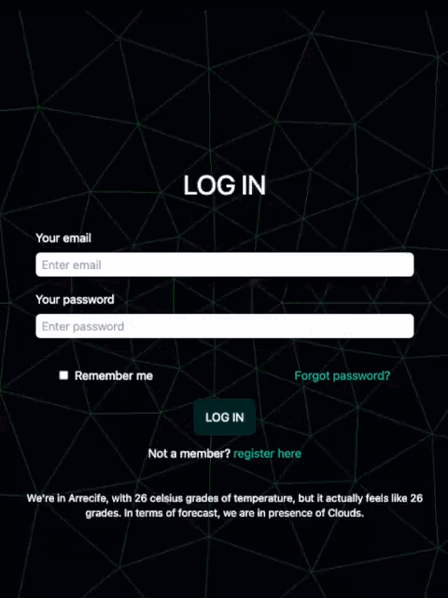

# __APP SOCIAL PORTAL__

## Intro

Introducing SOCIAL PORTAL, an app that closely resembles popular social media platforms like Instagram. With features such as photo uploading, editing, deletion, favoriting, and liking, it provides a familiar social experience. Building SOCIAL PORTAL has been a valuable learning journey, allowing us to deepen our expertise in technologies like React and more.

## __Functional description__

### ___Use cases___

- add post
- modify post
- remove post
- toggle like post 
- toggle fav post

## __Technical description__

### ___Data model___

User
- id (string)
- name (string)
- email (string)
- password (string)
- avatar (string)
- favs (string array, refers to Post id) 

Post
- id (string)
- author (string, refers to User id)
- image (string)
- text (string)
- likes (string array, refers to User id)

